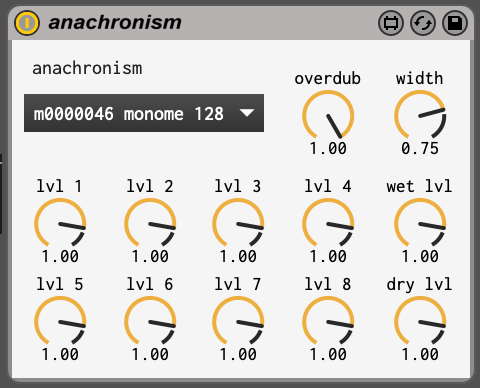
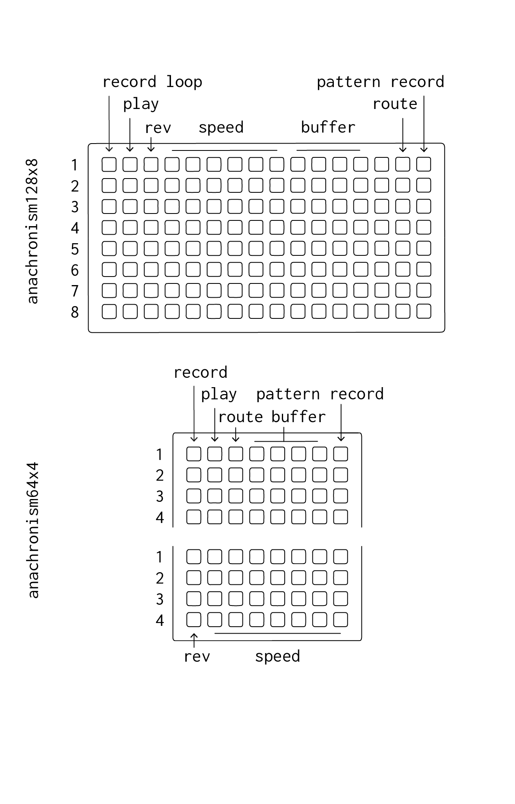

# anachronsim

8 voice x 8 minute digital tape sampling interface for grids + max for live. speaks to other devices in `prosody` through `diction`.

### Requirements

[Ableton Live](https://www.ableton.com/en/live/)

[Max for Live](https://www.ableton.com/en/live/max-for-live/)

[128 or 64 grid](https://monome.org/)

### first steps

1.  open a live set, drop a device in a track.

2.  select your grid from the dropdown on anachronism

3.  press the top left key on the grid to create a loop. make a sound. press the top left key again to end recording.

4. recording while a channel is not playing results in a new loop.

5. speed controls both record and and play rate. hold two keys and release to glide - this is very expressive (!)

6. 'buffer' selects which buffer the voice reads/writes to (either 1-4 or 5-8) (there are 8 buffers). using separate voices to record to and pay back from buffer, for example, yields additional performance options.

7. pattern record captures key presses on the grid. cycle through record > (press some other buttons) > playback > reset. each pattern button only captures changes made on its own row.

8. on the standalone .amxd there are options for dry signal + voice levels, voice-wide overdub (for exploring delays), and voice-wide panning (width).

9. the current repo includes some beta tests - `ekphras.satellite` and `anachronism.remote`. place 4 or 8 instances of `ekphras.satellite` in Ableton (use the yellow selector at the top to assign the right row) along with the remote device. now `anachronism` is controlling each `ekphras`, which can be addressed individually with separate audio tracks and modulation sources. you can also drop samples into the buffer window.

10. an experiment: with multi-tracking set up, place the `.remote` device in a separate audio track from the `ekphras` tracks. the 'route' key now sends the audio out for the `ekphras` track to the track that the `remote` device is in. so, for example, if you set all your tracks to a common audio source, you can now route back into that main track and into the other loops from the grid.

[download](https://github.com/AndrewShike/anaphora/anachronsim/master.zip)
